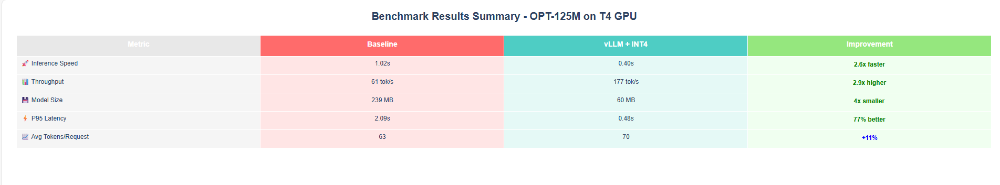

# VLLM_HuggingFace_Perf_Benchmark

# LLM Inference Benchmark: vLLM inference engine + INT4 Quantization vs Hugging Face (Facebook/OPT-125M)

Run **bigger LLMs on smaller devices** with:
- **vLLM** (PagedAttention) inference engine
- **INT4 quantization** to reduce model memory size

This repo reproduces a **real-world benchmark** comparing **Hugging Face FP16 inference** vs **vLLM with INT4 quantized inference** on **Facebook/OPT-125M**.

> TL;DR (from our Colab T4 run):
- **Latency:** 1.02s → **0.40s** (↓ ~61%)
- **Throughput:** 61.38 → **176.70 tokens/s** (~**2.9×**)
- **Model memory size:** **−75%** (INT4 vs FP16)

## 🔬 Process Difference

> vLLM combines **PagedAttention**, **INT4 quantized weights (BitsAndBytes)**, **continuous batching**, and **optimized CUDA kernels**, which drives higher throughput, lower latency, and **~75% reduced model memory size** vs the standard Hugging Face FP16 baseline.

## ✨ Results

## Improvements

## 75% reduced Model Size

## Average Throughput

## Average Latency

## Tail Latency

## Whats Inside
- One-click **Colab notebook** for T4 GPU
- **Beautiful charts + graphs** for visualization of benchmarking
- Clear **methodology** + **troubleshooting** notes

---

## 🚀 Quickstart

### Google Colab
1. Open the notebook: **[vllm_quant_inference_benchmark.ipynb](https://colab.research.google.com/github/ashishmokalkar/VLLM_HuggingFace_Perf_Benchmark/blob/main/vllm_quant_inference_benchmark.ipynb)**  in google colab
2. `Runtime → Change runtime type → GPU (T4)`
3. Run all cells (installs deps, runs benchmark, saves the results in csv and json file ).
